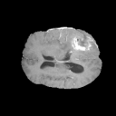
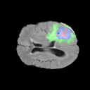
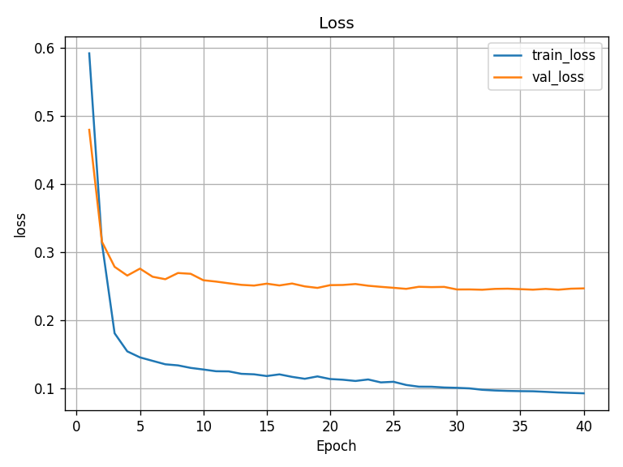
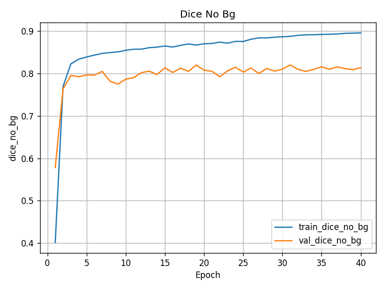
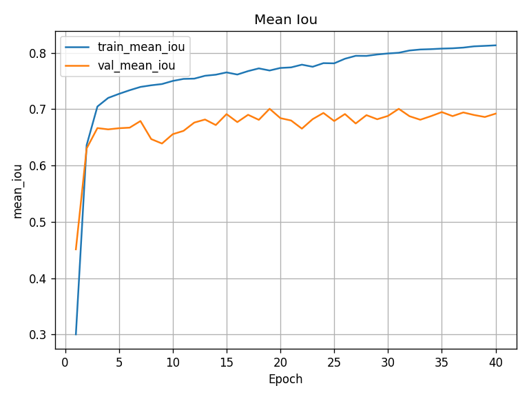
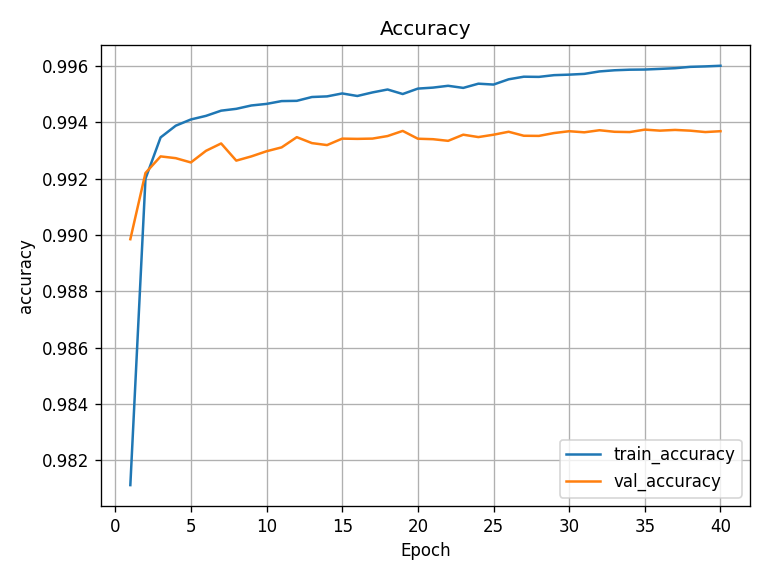
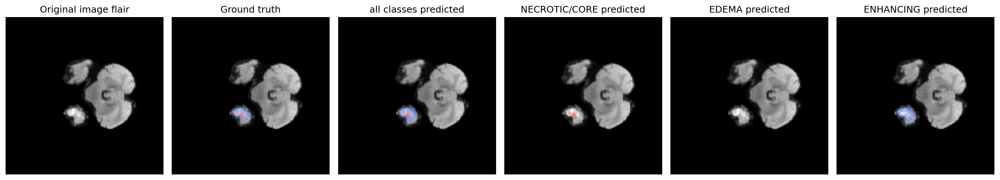
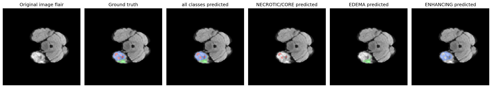
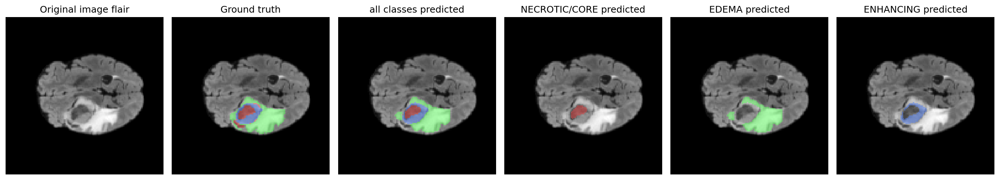
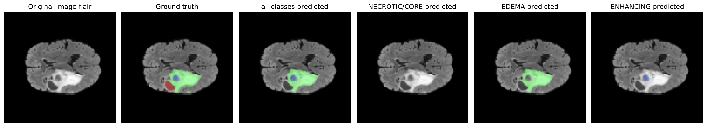

# Brain Tumor Segmentation with PyTorch

This project provides a complete pipeline for brain tumor segmentation using a 2D U-Net model implemented in PyTorch. It is designed to work with the [BraTS 2020 dataset](https://www.med.upenn.edu/cbica/brats2020/data.html) and includes scripts for training, evaluation, and visualization.

## Table of Contents
- [Data Samples](#data-samples)
- [Project Structure](#project-structure)
- [Features](#features)
- [Setup and Installation](#setup-and-installation)
- [Usage](#usage)
  - [Training](#training)
  - [Visualization](#visualization)
- [Results](#results)
  - [Evaluation Metrics](#evaluation-metrics)
  - [Training & Validation Curves](#training--validation-curves)
  - [Qualitative Results (Segmentation Examples)](#qualitative-results-segmentation-examples)
- [Configuration](#configuration)
- [Dependencies](#dependencies)
- [Data & Licensing](#data--licensing)

## Data Samples

The model is trained on multimodal 3D MRI scans from the BraTS 2020 dataset. The primary input modalities used in this project are T1-weighted contrast-enhanced (T1ce) and FLAIR scans. The ground truth labels segment the tumor into three regions: Necrotic and Non-Enhancing Tumor (NCR/NET), Edema, and Enhancing Tumor (ET).

**Example figure** below is a visualization produced locally from the BraTS dataset (for demonstration only).
No dataset files are redistributed here. Please cite the works if you use the data.

| FLAIR Scan | T1ce Scan | Ground Truth Label | Ground Truth Overlay | 
| :---: | :---: | :---: | :---: |
|   |  |  |   |

---

## Project Structure

The repository is organized to separate configuration, source code, and scripts for clarity.

```
.
├── configs/              # Configuration files for training (e.g., small.yaml)
├── data/                 # Local data directory (ignored by Git).
├── Output/               # Saved models and logs from training (ignored by Git).
├── requirements.txt      # A list of all Python dependencies.
├── scripts/              # High-level scripts to run the project.
│   ├── train.py          # Script to start model training.
│   └── visualize.py      # Script to visualize model predictions on a case.
└── src/                  # Main source code package.
    ├── engine/           # Core training and evaluation loops.
    ├── models/           # Model architectures (e.g., UNet2D).
    ├── utils/            # Utility functions (e.g., device handling).
    ├── data/             # Data preprocessing and data loader. 
    ├── losses/           # Calculating losses.
    ├── metrics/          # Evaluation matrics.
    └── viz/              # Visualization and prediction logic.
```

## Features
- **2D U-Net Architecture**: A classic and effective model for biomedical image segmentation.
- **Configuration-Driven Training**: Easily manage hyperparameters and settings using YAML files.
- **Training & Validation Loop**: Includes standard training and validation steps.
- **Prediction Visualization**: A script to load a trained model and visualize its predictions on a specific MRI slice.

## Setup and Installation

Follow these steps to set up the project environment.

1.  **Clone the Repository**
    ```bash
    git clone <your-repository-url>
    cd Brain-Tumor-Segmentation-Project
    ```

2.  **Create a Virtual Environment (Recommended)**
    This isolates project dependencies from your system's Python environment.
    ```bash
    python3 -m venv venv
    source venv/bin/activate
    # On Windows, use: venv\Scripts\activate
    ```

3.  **Install Dependencies**
    Install all required packages from the `requirements.txt` file.
    ```bash
    pip install -r requirements.txt
    ```

4.  **Download the Dataset**
    - Download the **BraTS 2020** training dataset from the [official website](https://www.med.upenn.edu/cbica/brats2020/data.html).
    - Create the data directory structure: `mkdir -p data/BraTS2020_TrainingData`.
    - Unzip and place the `MICCAI_BraTS2020_TrainingData` folder inside `data/BraTS2020_TrainingData/`. The final path to a case should look like: `data/BraTS2020_TrainingData/MICCAI_BraTS2020_TrainingData/BraTS20_Training_001`.

## Usage

All scripts should be run from the root directory of the project. The `PYTHONPATH=.` prefix is required to ensure Python can find the `src` module.

### Training

To train the model, run the `train.py` script with a specified configuration file.

```bash
PYTHONPATH=. python scripts/train.py -c configs/small.yaml
```
Progress will be printed to the console, and the trained model weights (`best_model.pt` and `last_model.pt`) will be saved in a timestamped folder inside the `Output/` directory.  If you want to train with more number of epochs and batch size, try run the above scrpit with `defalut.yaml`.

### Visualization

To visualize a model's prediction on a single MRI slice, use the `visualize.py` script.

```bash
PYTHONPATH=. python scripts/visualize.py \
  --weights Output/Output_YYYYMMDD_HHMMSS/weights/best_model.pt \
  --root ./data/BraTS2020_TrainingData/MICCAI_BraTS2020_TrainingData \
  --case BraTS20_Training_XXX \
  --slice 60
```
- Replace `YYYYMMDD_HHMMSS` with the timestamp of your training run.
- Replace `XXX` with the actual patient ID assigned as test dataset stored as .json file in Output folder.
- `--case` specifies the patient ID to visualize.
- `--slice` specifies the axial slice number to display.

## Results

The model was trained for 40 epochs using the configuration specified in `configs/default.yaml`. The following results were achieved on the validation set.

### Evaluation Metrics

Here is a summary of the final performance metrics on the validation set.

| Metric | Value |
| :--- | :---: |
| Validation Loss | 0.234 |
| Validation Accuracy | 0.994% |
| Validation Mean IoU | 0.729 |
| Validation Dice (no background) | 0.841 |

### Training & Validation Curves

The plots below show the change in key metrics over the training epochs.

| Loss vs. Epochs | Dice vs. Epochs |
| :---: | :---: |
|  |  |
| **Mean IoU vs. Epochs** | **Accuracy vs. Epochs** |
|  |  |

### Qualitative Results (Segmentation Examples)

Visual comparison of the model's predictions against the ground truth labels for representative validation cases.

---

---

---

---

---

---

## Configuration

All training and model parameters can be modified in the `.yaml` files located in the `configs/` directory. This includes:
- `model_params`: U-Net architecture settings (e.g., `in_ch`, `n_classes`).
- `training_params`: Learning rate, batch size, number of epochs.
- `data_params`: Paths to the dataset.

## Dependencies

The main dependencies for this project are listed in `requirements.txt`:
- `numpy`
- `torch` & `torchvision`
- `scikit-learn`
- `nibabel` (for reading `.nii` files)
- `opencv-python`
- `matplotlib`
- `PyYAML`

## Data & Licensing

This project uses the BraTS 2020 dataset. The dataset itself is **not** included in this repository.
Please obtain it from the official sources and follow their usage guidelines and citation requirements:

- Menze et al., IEEE TMI 2015. DOI: 10.1109/TMI.2014.2377694  
- Bakas et al., Scientific Data 2017. DOI: 10.1038/sdata.2017.117  
- Bakas et al., arXiv:1811.02629 (2018)  
- Bakas et al., TCIA (TCGA-GBM) 2017. DOI: 10.7937/K9/TCIA.2017.KLXWJJ1Q  
- Bakas et al., TCIA (TCGA-LGG) 2017. DOI: 10.7937/K9/TCIA.2017.GJQ7R0EF
